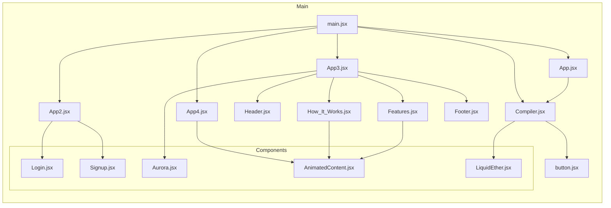

    

    <b>Automatic Architecture Diagrams from Code</b> 
    <a href="https://github.com/swark-io/swark">GitHub</a> • <a href="https://swark.io">Website</a> • <a href="mailto:contact@swark.io">Contact Us</a>

## Usage Instructions

1. **Render the Diagram**: Use the links below to open it in Mermaid Live Editor, or install the [Mermaid Support](https://marketplace.visualstudio.com/items?itemName=bierner.markdown-mermaid) extension.
2. **Recommended Model**: If available for you, use `claude-3.5-sonnet` [language model](vscode://settings/swark.languageModel). It can process more files and generates better diagrams.
3. **Iterate for Best Results**: Language models are non-deterministic. Generate the diagram multiple times and choose the best result.

## Generated Content
**Model**: GPT-4o - [Change Model](vscode://settings/swark.languageModel)  
**Mermaid Live Editor**: [View](https://mermaid.live/view#pako:eNp9lE1vgzAMhv8KyrndAThxmNSPVevUnVppk8ZUpU1Ks5WEhUTbVPW_Lx-Q0hCWC7afNzGODWewZwiDDOS04LA6Rpt5TiO1armzgWdIqA3phQjHe0EYjTbTa1Rrntavb6V63n3UP-9XNKkqTdSjD-KGxH2UNCjpo7RBqYdmrKzICXONW9uTTKUQzLzpzlgefmTfS_HC-GetJcrbLsXW-L4QQ2QTWcvDC8aExdbyMYZCcmyStLYncbevC2EUU1Ff4XAf9FqxwjbDGN65eq1JQaVpirUCkonkjENzz8YKSFbkSxL0II620I4bOo-SEgqMZowKVYs5-DbkbcIUWccY1myGLBqP75upCsbjIZAMgTQIOuNkoc05yOIWtg3oE3fzDiUtchPVR51xCezrjmxgbzuJfeR67FDqUK9dVtMp2-jc5xTGtyNiNTfv-2-yTtmDOjACJebqr4PUH-ycA5WqxDnIohwgfIDyJHJwUSJZIbV1TqD6qEqQCS7xCEAp2PqX7lufM1kcQXaApxpf_gCU3pBi) | [Edit](https://mermaid.live/edit#pako:eNp9lE1vgzAMhv8KyrndAThxmNSPVevUnVppk8ZUpU1Ks5WEhUTbVPW_Lx-Q0hCWC7afNzGODWewZwiDDOS04LA6Rpt5TiO1armzgWdIqA3phQjHe0EYjTbTa1Rrntavb6V63n3UP-9XNKkqTdSjD-KGxH2UNCjpo7RBqYdmrKzICXONW9uTTKUQzLzpzlgefmTfS_HC-GetJcrbLsXW-L4QQ2QTWcvDC8aExdbyMYZCcmyStLYncbevC2EUU1Ff4XAf9FqxwjbDGN65eq1JQaVpirUCkonkjENzz8YKSFbkSxL0II620I4bOo-SEgqMZowKVYs5-DbkbcIUWccY1myGLBqP75upCsbjIZAMgTQIOuNkoc05yOIWtg3oE3fzDiUtchPVR51xCezrjmxgbzuJfeR67FDqUK9dVtMp2-jc5xTGtyNiNTfv-2-yTtmDOjACJebqr4PUH-ycA5WqxDnIohwgfIDyJHJwUSJZIbV1TqD6qEqQCS7xCEAp2PqX7lufM1kcQXaApxpf_gCU3pBi)

